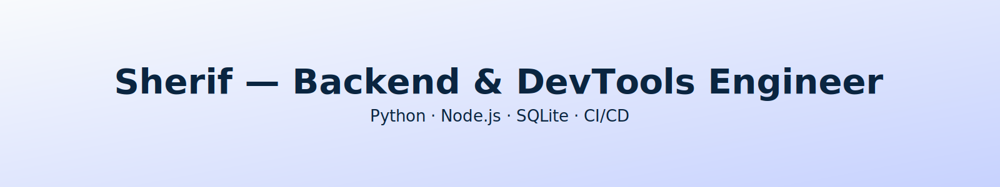
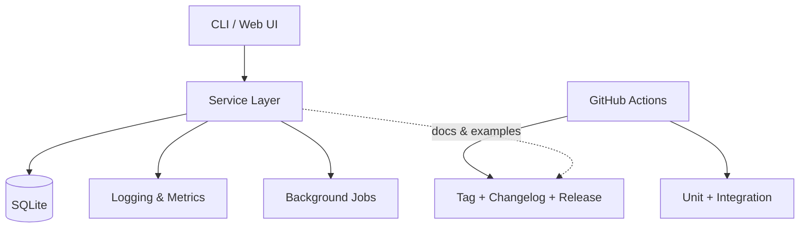
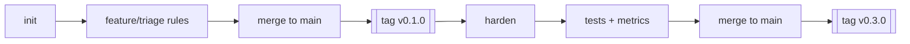
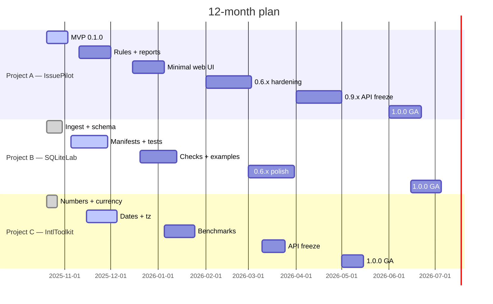

<p align="center">
  
</p>

<p align="center">
  <a href="https://github.com/sherif69-sa"></a>
  
  
  
  
</p>

<p align="center">
  <a href="#flagship-projects-pinned"></a>
  <a href="#pull-request-playbook"></a>
  <a href="#contact"></a>
</p>

---

## About me
I build **reliable backends** and **developer tooling** with a focus on clean interfaces, deterministic behavior, and docs that make other engineers faster.

- **Focus:** backend systems · DevTools · Python/Node · SQLite-first workflows
- **Workflow:** design note → small PRs → tests & CI → release → docs
- **Strengths:** scoped PRs · clear tradeoffs · observability · stable contracts

---

## Focus mix


## System blueprint (typical project)



## Release flow (visual)



---

## Public roadmap



---

## Flagship projects (pinned)

| Project         | What it does                                                                                           | Core tech                        |
| --------------- | ------------------------------------------------------------------------------------------------------ | -------------------------------- |
| **IssuePilot**  | GitHub issue triage (CLI + minimal web). Deterministic rules first; optional AI label/duplicate hints. | Python, GitHub API, FastAPI (UI) |
| **SQLiteLab**   | SQLite-first data flows (manifests, scripts, tests). Portable analytics with zero infra.               | Python, SQLite, CSV/Parquet      |
| **IntlToolkit** | Intl.NumberFormat + date/currency utilities with a minimal, stable API.                                | Node.js 20+, ESM                 |

---

## Pull Request playbook

### PR checklist

* Scope fits in one review session
* Why (user impact) at the top
* What changed in bullets
* Tests updated/added and CI green
* Docs updated if behavior changed
* Changelog note if user-facing

### PR template

```markdown
### Why
Short user-facing reason. Link to issue/design note.

### What changed
- bullet
- bullet

### How to test
- steps
- expected result

### Notes
risks, tradeoffs, follow-ups
```

---

## Coding standards

### Python

* Type hints for public APIs
* `pathlib`, `subprocess.run(check=True)`, `logging` (no prints in libs)
* Small functions, single responsibility
* CLI via `python -m <pkg>.cli` with `argparse`

### Node/JS

* ESM only, Node 20+
* `node:test` for unit tests
* Keep runtime deps minimal

---

## Contact

* LinkedIn: [https://www.linkedin.com/in/sherif-atef-b1077a124/](https://www.linkedin.com/in/sherif-atef-b1077a124/)

---

## Visual metrics

<details>
<summary>Expand</summary>

* GitHub overview: [https://github.com/sherif69-sa?tab=overview](https://github.com/sherif69-sa?tab=overview)
* Repositories: [https://github.com/sherif69-sa?tab=repositories](https://github.com/sherif69-sa?tab=repositories)
* Stars: [https://github.com/sherif69-sa?tab=stars](https://github.com/sherif69-sa?tab=stars)

</details>
```
