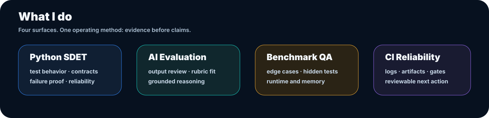
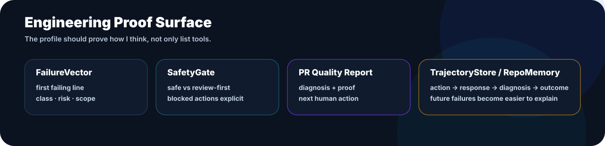
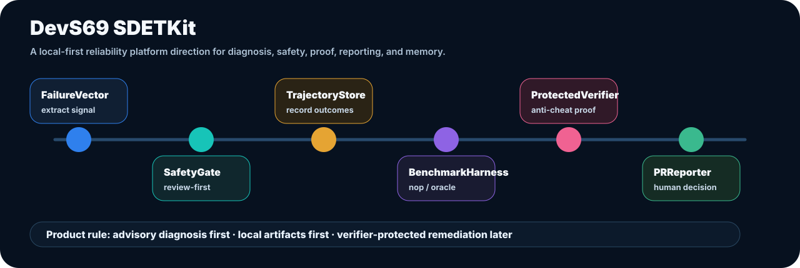
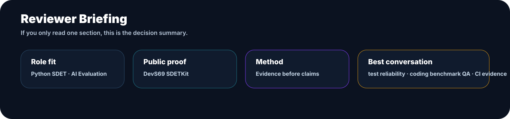

<p align="center">
  
</p>

<p align="center">
  <a href="https://github.com/sherif69-sa"></a>
  <a href="https://www.linkedin.com/in/devs69/"></a>
  <a href="https://leetcode.com/u/sherif69/"></a>
</p>

## Signature

I build **evidence-first validation systems** for code, CI, repositories, and AI-generated outputs.

My work is about reproducing failures, extracting exact signals, validating behavior, and turning noisy engineering output into decisions a reviewer can trust.

```text
Clone → Reproduce → Inspect → Prove → Report
```

<p align="center">
  
</p>

---

## Engineering proof surface

<p align="center">
  
</p>

```text
failure_vector:
  signal=<first real failing line>
  class=<test|lint|type|dependency|security|unknown>
  scope=<pr-owned|owner-files|review-first>
  proof=<focused command + quality gate>
```

This is the core of how I approach SDET, AI evaluation, and benchmark QA work: separate the loud headline from the actual contract, prove the behavior, and make the next action reviewable.

---

## Flagship project — DevS69 SDETKit

**DevS69 SDETKit** is my main public engineering project.

It is a local-first reliability platform direction for CI diagnosis, evidence artifacts, safe-fix boundaries, trajectory memory, protected verification, and PR-quality reporting.

Repository: **https://github.com/sherif69-sa/DevS69-sdetkit**

<p align="center">
  
</p>

| Layer | Direction |
| --- | --- |
| **FailureVectorEngine** | extract exact failure evidence from noisy CI and terminal output |
| **SafetyGate** | decide safe vs review-first with explicit blocked actions |
| **TrajectoryStore / RepoMemory** | record action → response → diagnosis → proof → outcome |
| **ReplayableBenchmarkHarness** | evaluate no-op, oracle, and unsafe repair scenarios |
| **ProtectedVerifier** | protect proof integrity and reject reward-hacking paths |
| **PRReporter / PatchScorer** | render exact evidence, proof, next action, and repair quality |

---

## Artifact library

These are the artifact shapes I want my work to produce: clear enough for a maintainer, strict enough for automation, and honest about what is proven versus predicted.

```text
root_cause_card:
  headline_failure=<loud signal>
  actual_failure=<first real contract>
  owner_files=<likely files>
  minimal_fix=<narrowest safe action>
  verification=<exact commands>
```

```text
review_first_decision:
  safe_fix_allowed=no
  reason=<unknown|security|dependency|release|broad scope>
  next_human_action=<exact review or proof step>
```

---

## Practice engine

LeetCode is part of my long-term programming discipline. I use it to sharpen correctness, hidden-test safety, runtime awareness, memory tradeoffs, and debugging speed.

Profile: **https://leetcode.com/u/sherif69/**

<p align="center">
  
</p>

| Track | Purpose |
| --- | --- |
| **Python / Python3** | main algorithms, data structures, design, DP, graphs, heaps, binary search, and performance discipline |
| **Pandas** | dataframe contracts, tables, logs, metrics, reports, and structured artifact thinking |
| **TypeScript** | support track for typed APIs, closures, classes, and JS/TS-specific implementation clarity |

---

## Reviewer briefing

<p align="center">
  
</p>

```text
role_fit=Python SDET / AI Evaluation / Coding Benchmark QA
public_project=DevS69 SDETKit
working_method=evidence-first validation
professional_signal=proof before claims
```

---

## Core stack

```text
Python · pytest · Pandas · Docker · Git · GitHub Actions
CLI workflows · JSON evidence · Markdown reports · CI-style validation
AI evaluation workflows · coding benchmark review · repository inspection
```

---

<p align="center">
  
</p>

- GitHub: **https://github.com/sherif69-sa**
- LinkedIn: **https://www.linkedin.com/in/devs69/**
- LeetCode: **https://leetcode.com/u/sherif69/**
- Email: **sherif.atef6300@gmail.com**
