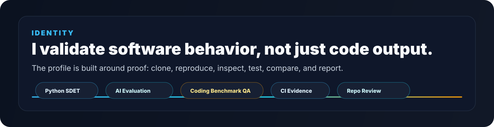
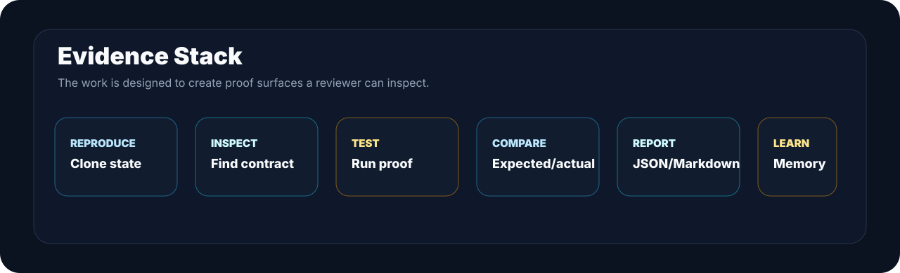
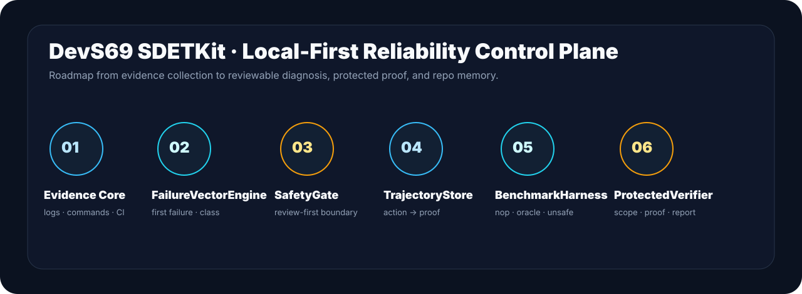
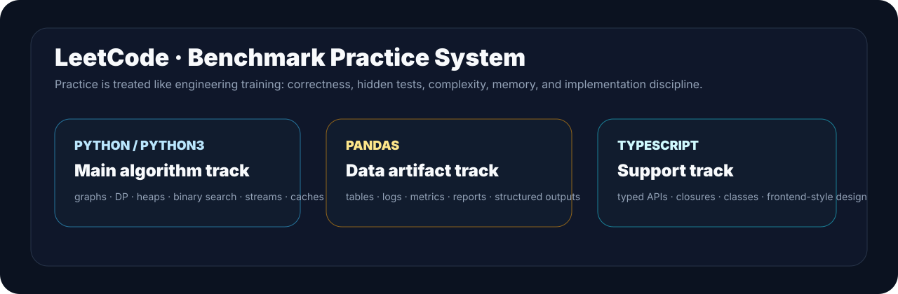

<p align="center">
  
</p>

<p align="center">
  <a href="https://github.com/sherif69-sa"></a>
  <a href="https://www.linkedin.com/in/devs69/"></a>
  <a href="https://leetcode.com/u/sherif69/"></a>
</p>

## About

I am **Sherif Atef**, a **Python SDET & AI Evaluation Engineer** focused on coding benchmark QA, test reliability, repository review, AI-generated code validation, and evidence-based engineering workflows.

I work best where software behavior must be reproduced, tested, reviewed, and explained clearly. My focus is not only writing code; it is validating whether the code, tests, expected behavior, and evidence all agree.

```text
Clone → Reproduce → Inspect → Test → Report
```

<p align="center">
  
</p>

---

## Portfolio Operating System

<p align="center">
  
</p>

This profile is built as a connected portfolio, not a random list of badges. The same operating loop appears across SDET work, AI evaluation, LeetCode practice, and my flagship project: reproduce the behavior, inspect the contract, test the result, and report the evidence.

> **Engineering note:** I care about whether a result is reproducible, reviewable, and supported by proof. A green check is useful only when the right proof ran for the right surface.

---

## Reviewer Signal Board

<p align="center">
  
</p>

| Signal | Why it matters |
| --- | --- |
| **Python SDET focus** | test behavior, reproduce failures, review fixes, and protect quality gates |
| **AI Evaluation alignment** | review model-generated code, benchmark tasks, rubrics, and expected outputs |
| **DevS69 SDETKit** | public project proving repo quality, CI evidence, and release-confidence thinking |
| **LeetCode discipline** | long-term practice for algorithms, data structures, Pandas, and TypeScript support |
| **Evidence mindset** | JSON reports, Markdown proof, command traces, and review-first decisions |

---

## Evidence Stack

<p align="center">
  
</p>

I use this stack when reviewing repositories, validating tasks, or debugging failures:

```text
reproduce the state
inspect the contract
run focused proof
compare expected vs actual
write the evidence
reuse the learning
```

This is the foundation behind my SDET work, AI evaluation workflow, and DevS69 SDETKit roadmap.

---

## Flagship Project — DevS69 SDETKit

**DevS69 SDETKit** is my main public engineering project.

It is an evidence-first Python SDET toolkit for release confidence, CI workflow governance, failure diagnosis, reproducible quality review, permission-review evidence, structured reporting, and review-first safety boundaries.

Repository: **https://github.com/sherif69-sa/DevS69-sdetkit**

<p align="center">
  
</p>

The long-term direction is a local-first reliability platform that helps maintainers move from noisy CI or terminal output to exact evidence, diagnosis, proof, and reviewable next action.

| Product layer | What it is meant to do |
| --- | --- |
| **Evidence Core** | collect logs, command output, CI metadata, artifacts, and proof surfaces |
| **FailureVectorEngine** | extract the first real failure and classify the failure surface |
| **SafetyGate** | keep unknown, broad, security, release, and dependency work review-first |
| **TrajectoryStore / RepoMemory** | record action → response → diagnosis → proof → outcome |
| **ReplayableBenchmarkHarness** | test no-op, oracle, and unsafe repair scenarios |
| **ProtectedVerifier / PRReporter** | preserve proof integrity and render actionable reports |

<details>
<summary><strong>What I am building toward</strong></summary>

```text
CI/local command fails
→ collect exact evidence
→ extract the first real failure
→ classify risk and owner surface
→ decide safe vs review-first
→ run focused proof
→ report the result
→ record the trajectory for future diagnosis
```

The project is intentionally conservative: diagnosis first, review-first for unknowns, and safe remediation only after narrow patterns are proven.

</details>

---

## LeetCode Practice System

LeetCode is part of my long-term programming discipline. I use it to strengthen habits that transfer into real engineering work: choosing the right algorithm, reducing runtime and memory overhead, debugging hidden-test failures, and writing clean code under constraints.

Profile: **https://leetcode.com/u/sherif69/**

<p align="center">
  
</p>

| Track | Purpose |
| --- | --- |
| **Python / Python3** | Main track for algorithms, data structures, design, graphs, DP, heaps, binary search, streams, and caches |
| **Pandas** | DataFrame and database-style practice for tables, logs, metrics, reports, and structured artifacts |
| **TypeScript** | Support track for JS/TS-specific problems, typed APIs, closures, classes, and frontend-style design |

```text
Correctness first
Hidden-test safety second
Optimal algorithm third
Memory awareness fourth
Practical runtime fifth
Micro-optimization last
```

---

## Working Method

| Step | What I do |
| --- | --- |
| **01 · Understand** | identify the exact task contract and expected behavior |
| **02 · Reproduce** | run the scenario or inspect the broken state |
| **03 · Inspect** | read implementation, tests, CI config, and evidence surfaces |
| **04 · Validate** | run focused proof before broad claims |
| **05 · Compare** | separate expected behavior from actual behavior |
| **06 · Report** | document the decision with command evidence and review notes |

This method applies to SDET work, AI evaluation, coding benchmark review, repository-quality validation, and CI evidence reporting.

---

## Core Stack

```text
Python · pytest · Pandas · Docker · Git · GitHub Actions
CLI workflows · JSON evidence · Markdown reports · CI-style validation
AI evaluation workflows · Coding benchmark review · Repository inspection
```

---

## Target Roles

- Python SDET
- AI Evaluation Engineer
- Coding Benchmark QA Engineer
- Test Automation Engineer
- CI Reliability / Quality Engineering
- LLM Workflow Evaluation
- Repository Review and Validation

---

## Contact

- LinkedIn: **https://www.linkedin.com/in/devs69/**
- GitHub: **https://github.com/sherif69-sa**
- LeetCode: **https://leetcode.com/u/sherif69/**
- Email: **sherif.atef6300@gmail.com**
