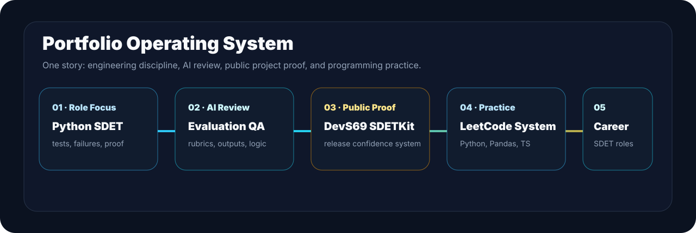
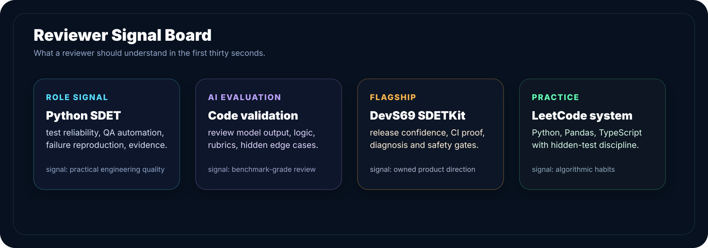
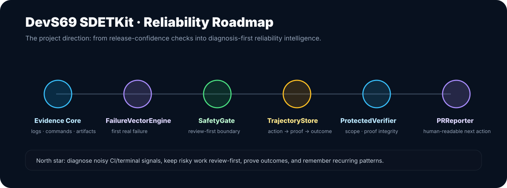
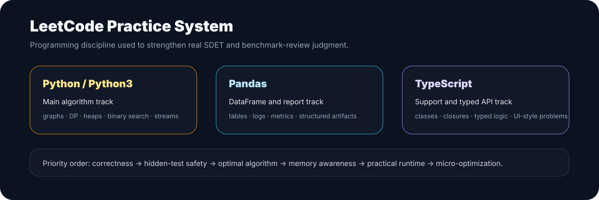
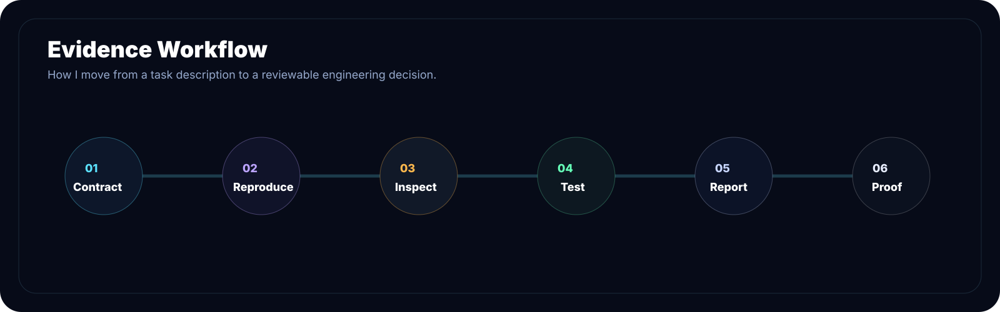

<p align="center">
  
</p>

<p align="center">
  <a href="https://github.com/sherif69-sa"></a>
  <a href="https://www.linkedin.com/in/devs69/"></a>
  <a href="https://leetcode.com/u/sherif69/"></a>
  <a href="mailto:sherif.atef6300@gmail.com"></a>
</p>

## About

I am **Sherif Atef**, a **Python SDET & AI Evaluation Engineer** focused on coding benchmark QA, test reliability, repository review, AI-generated code validation, and evidence-based engineering workflows.

My work is built around one idea: software quality is not only about writing code; it is about proving that the code, tests, expected behavior, and evidence all agree.

```text
Clone → Reproduce → Inspect → Test → Explain → Report
```

---

## Portfolio System

<p align="center">
  
</p>

This profile is designed around a connected professional story: **SDET discipline**, **AI-evaluation judgment**, **coding benchmark practice**, and a flagship project that turns those habits into a real repository-quality system.

---

## Reviewer Signal

<p align="center">
  
</p>

| Signal | What it means in practice |
| --- | --- |
| **Reproducibility** | I do not judge a result before I can reproduce the behavior. |
| **Failure analysis** | I separate noisy symptoms from the first real failing contract. |
| **AI-code review** | I review generated code against task logic, edge cases, and expected output. |
| **Evidence reporting** | I prefer proof commands, artifacts, and reviewable summaries over vague claims. |

---

## Professional Capability Grid

<p align="center">
  
</p>

| Area | Practical focus |
| --- | --- |
| **Python SDET** | pytest validation, failure reproduction, test and fix review |
| **AI Evaluation** | model-output review, task logic, rubric alignment, source-grounded QA |
| **Coding Benchmark QA** | hidden edge cases, expected behavior, reference checks, reproducibility risks |
| **CI Evidence** | GitHub Actions review, command proof, JSON / Markdown artifacts |
| **Repository Review** | clone, inspect, compare broken/fixed states, validate behavior |
| **Quality Communication** | explain root cause, patch scope, risk, and next verification step |

---

## Flagship Project — DevS69 SDETKit

**DevS69 SDETKit** is my main public engineering project.

It is an evidence-first Python SDET toolkit for release confidence, CI workflow governance, failure diagnosis, reproducible quality review, permission-review evidence, structured reporting, and review-first safety boundaries.

Repository: **https://github.com/sherif69-sa/DevS69-sdetkit**

<p align="center">
  
</p>

The long-term direction is a local-first reliability platform that helps maintainers move from noisy CI or terminal output to exact evidence, diagnosis, proof, and reviewable next action.

| Product layer | What it is meant to do |
| --- | --- |
| **Evidence Core** | collect logs, command output, CI metadata, artifacts, and proof surfaces |
| **FailureVectorEngine** | extract the first real failure and classify the failure surface |
| **SafetyGate** | keep unknown, broad, security, release, and dependency work review-first |
| **TrajectoryStore / RepoMemory** | record action → response → diagnosis → proof → outcome |
| **ReplayableBenchmarkHarness** | test no-op, oracle, and unsafe repair scenarios |
| **ProtectedVerifier / PRReporter** | preserve proof integrity and render actionable reports |

<details>
<summary><strong>Why this project matters</strong></summary>

Most CI failures are noisy. A final red check often hides the actual first broken contract. DevS69 SDETKit is my long-term attempt to build a practical reliability layer that can read repository evidence, classify failures, explain risk, and guide the next safe action without pretending that unknown failures are safe to fix automatically.

</details>

---

## LeetCode Practice System

LeetCode is part of my long-term programming discipline. I use it to strengthen habits that transfer into real engineering work: choosing the right algorithm, reducing runtime and memory overhead, debugging hidden-test failures, and writing clean code under constraints.

Profile: **https://leetcode.com/u/sherif69/**

<p align="center">
  
</p>

| Track | Purpose |
| --- | --- |
| **Python / Python3** | Main track for algorithms, data structures, design, graphs, DP, heaps, binary search, streams, and caches |
| **Pandas** | DataFrame and database-style practice for tables, logs, metrics, reports, and structured artifacts |
| **TypeScript** | Support track for JS/TS-specific problems, typed APIs, closures, classes, and frontend-style design |

```text
Correctness first
Hidden-test safety second
Optimal algorithm third
Memory awareness fourth
Practical runtime fifth
Micro-optimization last
```

---

## Evidence Workflow

<p align="center">
  
</p>

This method applies to SDET work, AI evaluation, coding benchmark review, repository-quality validation, and CI evidence reporting.

---

## Core Stack

```text
Python · pytest · Pandas · Docker · Git · GitHub Actions
CLI workflows · JSON evidence · Markdown reports · CI-style validation
AI evaluation workflows · Coding benchmark review · Repository inspection
```

---

## Target Roles

- Python SDET
- AI Evaluation Engineer
- Coding Benchmark QA Engineer
- Test Automation Engineer
- CI Reliability / Quality Engineering
- LLM Workflow Evaluation
- Repository Review and Validation

---

## Contact

- LinkedIn: **https://www.linkedin.com/in/devs69/**
- GitHub: **https://github.com/sherif69-sa**
- LeetCode: **https://leetcode.com/u/sherif69/**
- Email: **sherif.atef6300@gmail.com**
