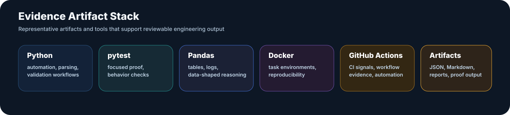

<p align="center">
  
</p>

<p align="center">
  <a href="https://github.com/sherif69-sa"></a>
  <a href="https://www.linkedin.com/in/devs69/"></a>
  <a href="https://leetcode.com/u/sherif69/"></a>
</p>

## About

I am a **Python SDET & AI Evaluation Engineer** focused on coding benchmark QA, test reliability, repository review, AI-generated code validation, and evidence-based engineering workflows.

I work best where software behavior must be reproduced, tested, reviewed, and explained clearly. My focus is not only writing code; it is validating whether the code, tests, expected behavior, and evidence all agree.

```text
Clone → Reproduce → Inspect → Test → Report
```

<p align="center">
  
</p>

---

## Reviewer Signal Board

<p align="center">
  
</p>

| Signal | What it tells a reviewer |
| --- | --- |
| **Python SDET** | I care about deterministic proof, contract validation, and reviewable correctness |
| **AI Evaluation** | I review outputs against task logic, rubric intent, and evidence, not vibes |
| **Coding Benchmark QA** | I focus on hidden tests, edge cases, and expected behavior under constraints |
| **CI Evidence** | I turn logs, checks, and workflow signals into concrete next actions |
| **DevS69 SDETKit** | My flagship public project shows how I think about reliability and quality systems |

---

## Flagship Project — DevS69 SDETKit

**DevS69 SDETKit** is my main public engineering project.

It is an evidence-first Python SDET toolkit for release confidence, CI workflow governance, failure diagnosis, reproducible quality review, permission-review evidence, structured reporting, and review-first safety boundaries.

Repository: **https://github.com/sherif69-sa/DevS69-sdetkit**

<p align="center">
  
</p>

The long-term direction is a local-first reliability platform that helps maintainers move from noisy CI or terminal output to exact evidence, diagnosis, proof, and reviewable next action.

| Product layer | What it is meant to do |
| --- | --- |
| **Evidence Core** | Collect logs, command output, CI metadata, artifacts, and proof surfaces |
| **FailureVectorEngine** | Extract the first real failure and classify the failure surface |
| **SafetyGate** | Keep unknown, broad, security, release, and dependency work review-first |
| **TrajectoryStore / RepoMemory** | Record action → response → diagnosis → proof → outcome |
| **ReplayableBenchmarkHarness** | Test no-op, oracle, and unsafe repair scenarios |
| **ProtectedVerifier / PRReporter** | Preserve proof integrity and render actionable reports |

<details>
<summary><strong>More on DevS69 direction</strong></summary>
<br>
The product direction follows a clear reliability stack: start with evidence, classify the real failure, keep risky changes review-first, record the trajectory, validate candidate behavior against replayable cases, and preserve proof integrity before reporting next action.
</details>

---

## Evidence Artifact Stack

<p align="center">
  
</p>

This stack represents the practical tools and artifact forms I use most often when validating behavior and documenting quality work.

---

## LeetCode Practice System

LeetCode is part of my long-term programming discipline. I use it to strengthen habits that transfer into real engineering work: choosing the right algorithm, reducing runtime and memory overhead, debugging hidden-test failures, and writing clean code under constraints.

Profile: **https://leetcode.com/u/sherif69/**

<p align="center">
  
</p>

| Track | Purpose |
| --- | --- |
| **Python / Python3** | Main track for algorithms, data structures, design, graphs, DP, heaps, binary search, streams, and caches |
| **Pandas** | DataFrame and database-style practice for tables, logs, metrics, reports, and structured artifacts |
| **TypeScript** | Support track for JS/TS-specific problems, typed APIs, closures, classes, and frontend-style design |

```text
Correctness first
Hidden-test safety second
Optimal algorithm third
Memory awareness fourth
Practical runtime fifth
Micro-optimization last
```

---

## Working Method

1. Understand the task contract.
2. Reproduce the behavior.
3. Inspect the implementation.
4. Run focused validation.
5. Compare expected vs actual behavior.
6. Document the evidence.

This method applies to SDET work, AI evaluation, coding benchmark review, repository-quality validation, and CI evidence reporting.

---

## Core Stack

```text
Python · pytest · Pandas · Docker · Git · GitHub Actions
CLI workflows · JSON evidence · Markdown reports · CI-style validation
AI evaluation workflows · Coding benchmark review · Repository inspection
```

---

## Target Roles

- Python SDET
- AI Evaluation Engineer
- Coding Benchmark QA Engineer
- Test Automation Engineer
- CI Reliability / Quality Engineering
- LLM Workflow Evaluation
- Repository Review and Validation

---

## Contact

- LinkedIn: **https://www.linkedin.com/in/devs69/**
- GitHub: **https://github.com/sherif69-sa**
- LeetCode: **https://leetcode.com/u/sherif69/**
- Email: **sherif.atef6300@gmail.com**
