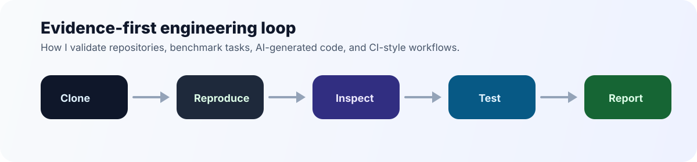
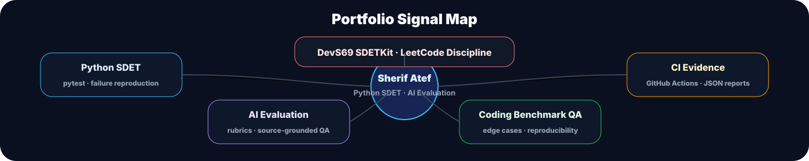
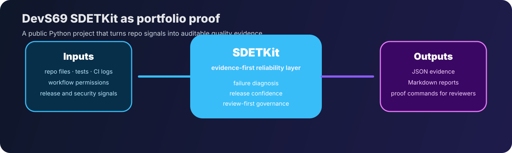
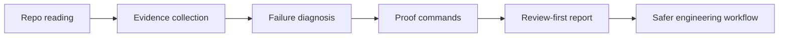
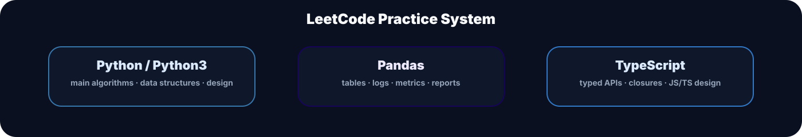
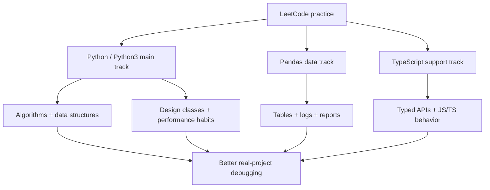
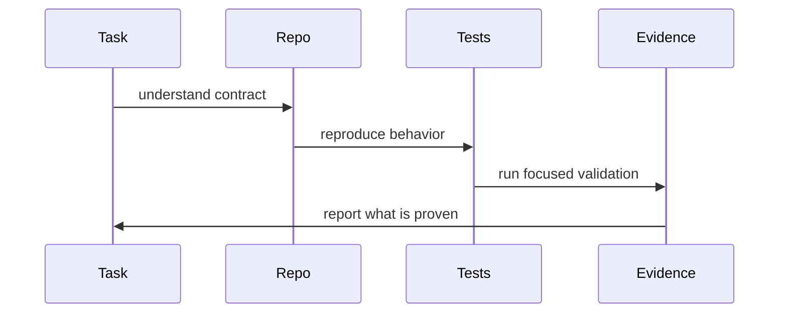
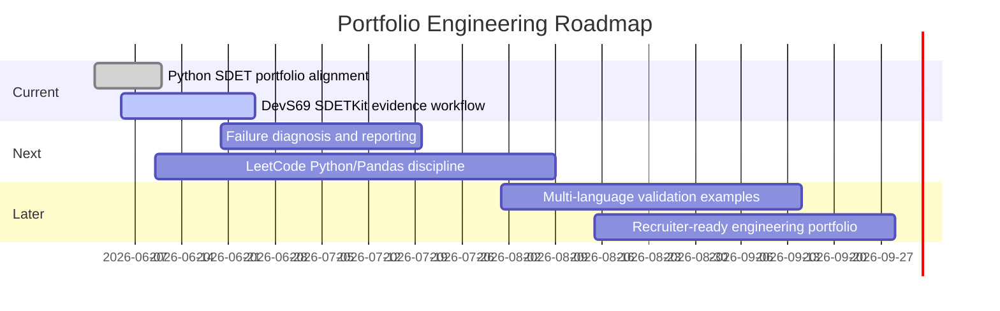

<p align="center">
  
</p>

<p align="center">
  <a href="https://github.com/sherif69-sa"></a>
  <a href="https://www.linkedin.com/in/devs69/"></a>
  <a href="https://leetcode.com/u/sherif69/"></a>
</p>

<p align="center">
  
  
  
  
  
</p>

---

## About

I am a **Python SDET & AI Evaluation Engineer** focused on coding benchmark QA, test reliability, repository review, AI-generated code validation, and evidence-based engineering workflows.

I work best where software behavior must be reproduced, tested, reviewed, and explained clearly. My focus is not only writing code; it is validating whether the code, tests, expected behavior, and evidence all agree.

<p align="center">
  
</p>

---

## Portfolio Signal Map

<p align="center">
  
</p>

| Signal | What it shows |
| --- | --- |
| **Python SDET** | pytest validation, failure reproduction, test and fix review |
| **AI Evaluation** | model-output review, task logic, rubric alignment, source-grounded QA |
| **Coding Benchmark QA** | hidden edge cases, expected behavior, reproducibility risks, reference checks |
| **CI Evidence** | GitHub Actions review, command proof, JSON/Markdown artifacts |
| **LeetCode Discipline** | algorithms, data structures, memory awareness, runtime tradeoffs |

<p align="center">
  
</p>

---

## Flagship Project: DevS69 SDETKit

<p align="center">
  
</p>

**DevS69 SDETKit** is my main public engineering project.

It is an evidence-first Python SDET toolkit for release confidence, CI workflow governance, failure diagnosis, reproducible quality review, permission-review evidence, structured reporting, and review-first safety boundaries.

Repository: **https://github.com/sherif69-sa/DevS69-sdetkit**

The project reflects how I approach engineering work:

```text
small changes
focused proof
clear CI evidence
professional repository operations
reviewable output
```

### DevS69 SDETKit direction


```mermaid
flowchart LR
  A[Repo reading] --> B[Evidence collection]
  B --> C[Failure diagnosis]
  C --> D[Proof commands]
  D --> E[Review-first report]
  E --> F[Safer engineering workflow]
```

---

## LeetCode Practice System

<p align="center">
  
</p>

LeetCode is part of my long-term programming discipline. I use it to strengthen habits that transfer into real engineering work: choosing the right algorithm, reducing runtime and memory overhead, debugging hidden-test failures, and writing clean code under constraints.

Profile: **https://leetcode.com/u/sherif69/**

| Track | Purpose |
| --- | --- |
| **Python / Python3** | Main track for algorithms, data structures, design, graphs, DP, heaps, binary search, streams, and caches |
| **Pandas** | DataFrame and database-style practice for tables, logs, metrics, reports, and structured artifacts |
| **TypeScript** | Support track for JS/TS-specific problems, typed APIs, closures, classes, and frontend-style design |

```text
Correctness first
Hidden-test safety second
Optimal algorithm third
Memory awareness fourth
Practical runtime fifth
Micro-optimization last
```

### Programming practice map


```mermaid
flowchart TD
  LC[LeetCode practice] --> PY[Python / Python3 main track]
  LC --> PD[Pandas data track]
  LC --> TS[TypeScript support track]
  PY --> A[Algorithms + data structures]
  PY --> B[Design classes + performance habits]
  PD --> C[Tables + logs + reports]
  TS --> D[Typed APIs + JS/TS behavior]
  A --> REAL[Better real-project debugging]
  B --> REAL
  C --> REAL
  D --> REAL
```

---

## Working Method

```text
01 Understand the task contract
02 Reproduce the behavior
03 Inspect the implementation
04 Run focused validation
05 Compare expected vs actual behavior
06 Document the evidence
```

This method applies to SDET work, AI evaluation, coding benchmark review, repository-quality validation, and CI evidence reporting.


```mermaid
sequenceDiagram
  participant Task
  participant Repo
  participant Tests
  participant Evidence
  Task->>Repo: understand contract
  Repo->>Tests: reproduce behavior
  Tests->>Evidence: run focused validation
  Evidence->>Task: report what is proven
```

---

## Core Stack

```text
Python · pytest · Pandas · Docker · Git · GitHub Actions
CLI workflows · JSON evidence · Markdown reports · CI-style validation
AI evaluation workflows · Coding benchmark review · Repository inspection
```

| Capability | Tools / habits |
| --- | --- |
| Test validation | Python, pytest, focused checks |
| Task environments | Docker, CLI workflows, reproducible commands |
| Review workflow | Git, GitHub, pull-request evidence |
| Structured reports | JSON evidence, Markdown reports |
| Data validation | Pandas, tabular checks, schema awareness |
| AI evaluation | model-output review, task logic, source-grounded QA |

---

## Roadmap I Am Building Toward


```mermaid
gantt
  title Portfolio Engineering Roadmap
  dateFormat  YYYY-MM-DD
  section Current
  Python SDET portfolio alignment       :done, 2026-06-01, 10d
  DevS69 SDETKit evidence workflow      :active, 2026-06-05, 20d
  section Next
  Failure diagnosis and reporting       :2026-06-20, 30d
  LeetCode Python/Pandas discipline     :2026-06-10, 60d
  section Later
  Multi-language validation examples    :2026-08-01, 45d
  Recruiter-ready engineering portfolio :2026-08-15, 45d
```

---

## Target Roles

- Python SDET
- AI Evaluation Engineer
- Coding Benchmark QA Engineer
- Test Automation Engineer
- CI Reliability / Quality Engineering
- LLM Workflow Evaluation
- Repository Review and Validation

---

## Contact

- LinkedIn: **https://www.linkedin.com/in/devs69/**
- GitHub: **https://github.com/sherif69-sa**
- LeetCode: **https://leetcode.com/u/sherif69/**
- Email: **sherif.atef6300@gmail.com**
