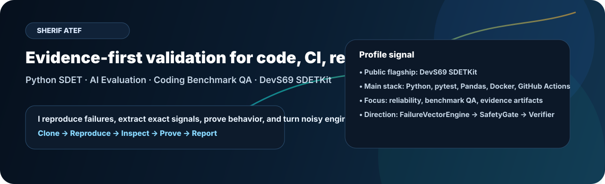
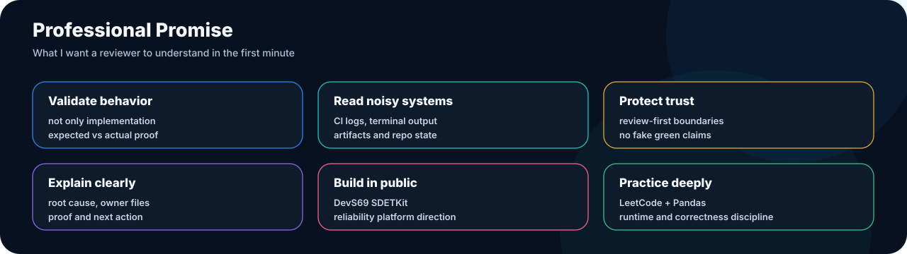
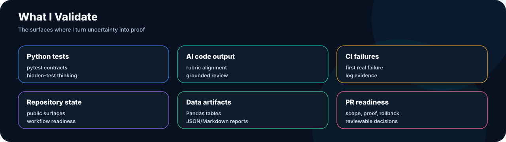
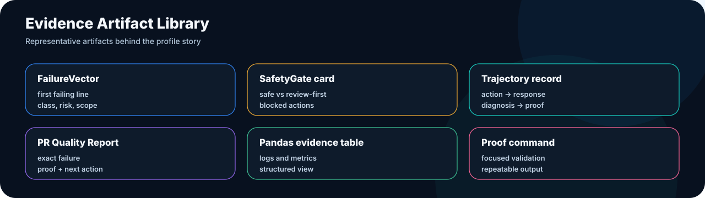
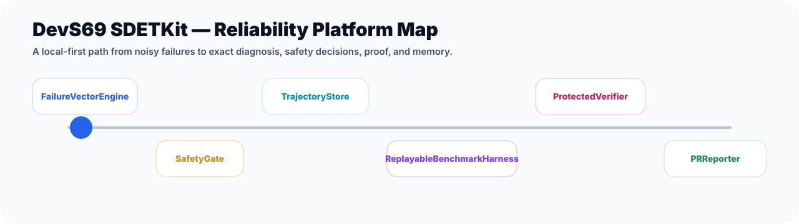
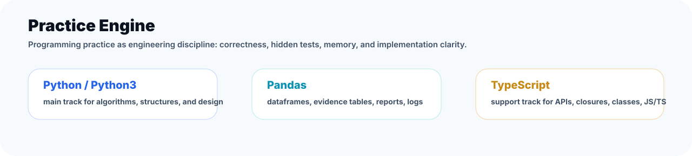
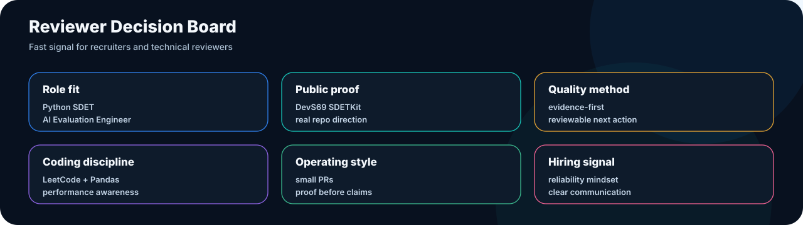
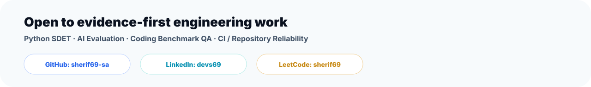

<p align="center">
  
</p>

<p align="center">
  <a href="https://github.com/sherif69-sa"></a>
  <a href="https://www.linkedin.com/in/devs69/"></a>
  <a href="https://leetcode.com/u/sherif69/"></a>
</p>

## Evidence-first engineering profile

I build **evidence-first validation systems** for code, CI, repositories, and AI-generated outputs.

My work focuses on reproducing failures, extracting exact signals, validating behavior, and turning noisy engineering output into reviewable decisions.

```text
Clone → Reproduce → Inspect → Prove → Report
```

<p align="center">
  
</p>

---

## What I validate

<p align="center">
  
</p>

| Surface | What I look for |
| --- | --- |
| **Python tests** | correctness, hidden-test behavior, regression signals, focused proof |
| **AI-generated code** | rubric alignment, task logic, hallucinated behavior, unsafe assumptions |
| **CI failures** | first real failing line, failed step, owner files, exact next command |
| **Repository quality** | public surface consistency, release readiness, workflow hygiene |
| **Data artifacts** | Pandas tables, structured logs, JSON/Markdown evidence reports |
| **PR readiness** | scope, proof, rollback, review-first safety boundaries |

---

## Evidence artifact library

<p align="center">
  
</p>

```text
failure_vector:
  check=<workflow/check>
  command=<failed command>
  first_failing_line=<exact signal>
  failure_class=<formatter|lint|type|test|dependency|security|unknown>
  safe_fix_candidate=<yes|no>
```

```text
review_decision:
  diagnosis=<what failed and why>
  proof=<focused command>
  blocked_actions=<what must not be changed>
  next_human_action=<exact command or review step>
```

---

## Flagship project — DevS69 SDETKit

**DevS69 SDETKit** is my main public engineering project.

It is a local-first reliability platform direction for Python SDET workflows, CI diagnosis, failure evidence, proof artifacts, safety gates, trajectory memory, and PR-quality reporting.

Repository: **https://github.com/sherif69-sa/DevS69-sdetkit**

<p align="center">
  
</p>

| Component | Product role |
| --- | --- |
| **FailureVectorEngine** | extracts the first real failure and turns it into structured evidence |
| **SafetyGate** | decides safe-fix eligibility and keeps unknown/risky work review-first |
| **TrajectoryStore / RepoMemory** | records action → response → diagnosis → proof → outcome |
| **ReplayableBenchmarkHarness** | evaluates no-op, oracle, and unsafe repair scenarios |
| **ProtectedVerifier** | independently checks patch scope, proof validity, and anti-cheat boundaries |
| **PRReporter / PatchScorer** | renders exact failure, safety decision, proof, next action, and repair score |

---

## Practice engine

LeetCode is part of my long-term programming discipline. I use it to strengthen algorithmic judgment, hidden-test safety, runtime awareness, memory tradeoffs, and debugging speed.

Profile: **https://leetcode.com/u/sherif69/**

<p align="center">
  
</p>

| Track | Purpose |
| --- | --- |
| **Python / Python3** | main algorithms and data-structure practice |
| **Pandas** | dataframe, table, log, and reporting practice |
| **TypeScript** | support track for typed APIs, closures, classes, and JS/TS-specific problems |

```text
Correctness → hidden-test safety → optimal algorithm → memory awareness → practical runtime
```

---

## Reviewer decision board

<p align="center">
  
</p>

A reviewer should be able to read this profile and quickly understand:

```text
role_fit=Python SDET / AI Evaluation / Coding Benchmark QA
public_project=DevS69 SDETKit
working_method=evidence-first validation
practice_system=Python + Pandas + TypeScript
professional_signal=proof before claims
```

---

## Core stack

```text
Python · pytest · Pandas · Docker · Git · GitHub Actions
CLI workflows · JSON evidence · Markdown reports · CI-style validation
AI evaluation workflows · coding benchmark review · repository inspection
```

---

## Target roles

- Python SDET
- AI Evaluation Engineer
- Coding Benchmark QA Engineer
- Test Automation Engineer
- CI Reliability / Quality Engineering
- LLM Workflow Evaluation
- Repository Review and Validation

---

<p align="center">
  
</p>

- LinkedIn: **https://www.linkedin.com/in/devs69/**
- GitHub: **https://github.com/sherif69-sa**
- LeetCode: **https://leetcode.com/u/sherif69/**
- Email: **sherif.atef6300@gmail.com**
