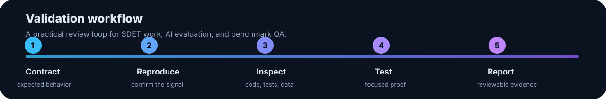
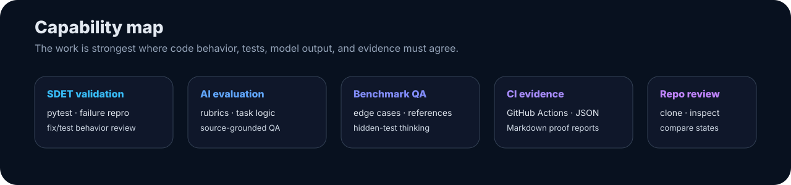
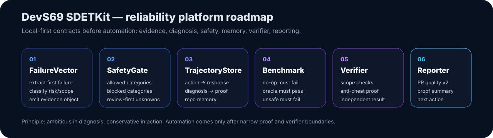
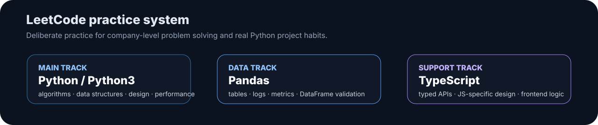

<p align="center">
  
</p>

<p align="center">
  <a href="https://github.com/sherif69-sa"></a>
  <a href="https://www.linkedin.com/in/devs69/"></a>
  <a href="https://leetcode.com/u/sherif69/"></a>
</p>

## About

I am a **Python SDET & AI Evaluation Engineer** focused on coding benchmark QA, test reliability, repository review, AI-generated code validation, and evidence-based engineering workflows.

I work best where software behavior must be reproduced, tested, reviewed, and explained clearly. My focus is not only writing code; it is validating whether the code, tests, expected behavior, and evidence all agree.

<p align="center">
  
</p>

---

## Professional Signal

<p align="center">
  
</p>

| Area | Practical focus |
| --- | --- |
| **Python SDET** | pytest validation, failure reproduction, test and fix review |
| **AI Evaluation** | model-output review, task logic, rubric alignment, source-grounded QA |
| **Coding Benchmark QA** | edge cases, expected behavior, reference checks, reproducibility risks |
| **CI Evidence** | GitHub Actions review, command proof, JSON / Markdown artifacts |
| **Repository Review** | clone, inspect, compare broken/fixed states, validate behavior |

---

## Flagship Project — DevS69 SDETKit

**DevS69 SDETKit** is my main public engineering project.

It is an evidence-first Python SDET toolkit for release confidence, CI workflow governance, failure diagnosis, reproducible quality review, permission-review evidence, structured reporting, and review-first safety boundaries.

Repository: **https://github.com/sherif69-sa/DevS69-sdetkit**

<p align="center">
  
</p>

The project reflects how I approach engineering work:

- small, reviewable changes
- focused tests before broad claims
- CI-style evidence
- professional repository operations
- clear reports another engineer can review

---

## LeetCode Practice System

LeetCode is part of my long-term programming discipline. I use it to strengthen habits that transfer into real engineering work: choosing the right algorithm, reducing runtime and memory overhead, debugging hidden-test failures, and writing clean code under constraints.

Profile: **https://leetcode.com/u/sherif69/**

<p align="center">
  
</p>

| Track | Purpose |
| --- | --- |
| **Python / Python3** | Main track for algorithms, data structures, design, graphs, DP, heaps, binary search, streams, and caches |
| **Pandas** | DataFrame and database-style practice for tables, logs, metrics, reports, and structured artifacts |
| **TypeScript** | Support track for JS/TS-specific problems, typed APIs, closures, classes, and frontend-style design |

```text
Correctness first
Hidden-test safety second
Optimal algorithm third
Memory awareness fourth
Practical runtime fifth
Micro-optimization last
```

---

## Working Method

```text
01 Understand the task contract
02 Reproduce the behavior
03 Inspect the implementation
04 Run focused validation
05 Compare expected vs actual behavior
06 Document the evidence
```

This method applies to SDET work, AI evaluation, coding benchmark review, repository-quality validation, and CI evidence reporting.

---

## Core Stack

```text
Python · pytest · Pandas · Docker · Git · GitHub Actions
CLI workflows · JSON evidence · Markdown reports · CI-style validation
AI evaluation workflows · Coding benchmark review · Repository inspection
```

---

## Target Roles

- Python SDET
- AI Evaluation Engineer
- Coding Benchmark QA Engineer
- Test Automation Engineer
- CI Reliability / Quality Engineering
- LLM Workflow Evaluation
- Repository Review and Validation

---

## Contact

- LinkedIn: **https://www.linkedin.com/in/devs69/**
- GitHub: **https://github.com/sherif69-sa**
- LeetCode: **https://leetcode.com/u/sherif69/**
- Email: **sherif.atef6300@gmail.com**
